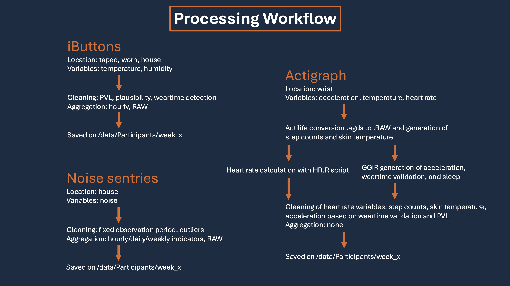

# The ACTUAL Project

[ACTUAL](https://www.ispm.unibe.ch/research/research_groups_and_themes/climate_epidemiology_and_public_health/index_eng.html#pane876954) (*Advancing research on extreme humid heat and health*) aims to advance knowledge about the impact of humid heat on human health through developing, diversifying, and applying new methodologies, data resources, and settings beyond existing current state-of-the-art approaches in climate epidemiology.

<br>

### Content of this repository

This repository includes the data management and processing of the ACTUAL project, a cohort study in The Gambia measuring temperature and humidity on and surrounding 80 participants over 4 seperate weeks in a sub-saharan climate.

<br>

# Processing Pipelines

A description of the processing and aggregation of the output of different devices is below the workflow image.




### REDCap

[REDCap](https://project-redcap.org/) logs metadata on the study procedure and measurements. In the `data processing/getREDCap.R` file I access REDCap via API and save the RAW output file as well as two aggregated versions on `CCH/Actual_project/data/App_Personal_Data_Screening/`.

### iButton (IB) data

The iButton data, saved on a Synology server, is first cleaned for each participant individually using the steps described in `vignettes/Data_Cleaning_Protocol_revised.Rmd`. The cleaned data is then compiled rowwise for all measurement devices individually in the RAW resolution, and additionally aggregated to hourly averages and then joined by all measurement devices (all variables in one table). Both files (RAW rowwise and hourly averages with joined columns) are saved to `CCH/Actual_project/data/Participants/week_X`.

```
├── data/Participants/week_1
   ├── week1_IB_hourly_data_clean.csv
   ├── week1_IBH_RAW_data_clean.csv
   ├── week1_IBT_RAW_data_clean.csv
   ├── week1_IBW_RAW_data_clean.csv
   ├── ...(other data)
```

### Actigraph data

The Actigraph data from Synology is converted/prepared using the Actilife program, which is done outside of this repository and not part of the processing pipeline presented here. 

The output from Actilife is then stored on `CCH/ACTUAL_project/raw-data/Actigraph/`. From the `../Actigraph/csv/` folder, first the .RAW files are copied into the `..Actigraph/participant/week_1/uid/` folders of the respective participant. Using the GGIR package (method: `vignettes/GGIR_Workflow.Rmd`), the weartime validation is computed and automatically saved in the `../Actigraph/participant/week_1/uid/RAW_processed/` folder of the same participant. This GGIR output is then copied into the `../Actigraph/participant/week_1/uid/` folder. The GGIR output is compiled rowwise for every dateset (weartime validation/sleep/..) in RAW format over all participants and saved into `CCH/Actual_project/data/Participants/week_X/`. 

Next, the mutiple heart rate variables are computed as described in the `data processing/Actigraph_00_HR_calculation.R` file, and together with step counts and temperature files are copied from the `../Actigraph/` folder to their `..Actigraph/participants/week_1/uid/` folders of the corresponding participant. Next, these files are cleaned using the weartime validation output of the GGIR package and the PVLs from REDCap before they are then compiled rowwise over all participant in RAW format to individual variable files and saved in the data folder `CCH/Actual_project/data/Participants/week_X/`. 

```
├── data/Participants/week_1
   ├── week1_actigraph_validation_RAW.csv
   ├── week1_actigraph_CR_RAW_data_cleaned.csv
   ├── week1_actigraph_HR_RAW_data_cleaned.csv
   ├── week1_actigraph_HRV_RAW_data_cleaned.csv
   ├── week1_actigraph_IBI_RAW_data_cleaned.csv
   ├── week1_actigraph_Steps_RAW_data_cleaned.csv
   ├── week1_actigraph_Temp_RAW_data_cleaned.csv
   ├── ...(other data)
```

### Noise data

The noise data was compiled from Synology and saved as a RAW file with some minor cleaning but without aggregation in the `CCH/Actual_project/data/Participants/week_X` folder. From this RAW data, hourly, daily, and weekly indicators for every participant are calculated and saved as 3 individual files combined for all participants for every week in the same location. The cleaning process and the indicators are described in `vignettes/Noise_processing.Rmd`.

```
├── data/Participants/week_1
   ├── week1_NS_RAW_data_clean.csv
   ├── week1_NS_indicators_hourly_data_clean.csv
   ├── week1_NS_indicators_daily_data_clean.csv
   ├── week1_NS_indicators_weekly_data_clean.csv
   ├── ...(other data)
```

<br>

# Folders

### The app_cleaned data folder

Using this `app_cleaned` app, I compare the cleaned and aggregated IB data to unclean aggregated IB data to investigate the impact of cleaning before the aggregation. The processes of cleaning are described in the `vignettes/Data_Cleaning_Protocol_revised.Rmd` and then implemented in the `data_processing` folder in the workflow of the `iButton_...` files

### The app_weekly_cleaning_reports folder

In the app: `app_weekly_cleaning_reports`, I answer the following questions in this App:

1. Who has been monitored per week/time-period? 
2. Which files are available per person?
3. What were the exposures of each person of the week?
4. Create a pdf-file for every time period that enables me to check what data is missing and if there are some major irregularities.

This app serves as a control for the measured data to ensure correct measurement intervals in line with the plan on REDCap. 

### The data processing folder

In the `data processing` folder I implement the data processing for the Actigraph data, the IB data and the noise sentry data. The data from REDCap can be updated on the `CCH` server using the `data processing/getREDCap.R` file.


### The vignettes folder

In the `vignettes` folder I demostrate multiple processes on example dataset that I then implemented in the data processing folder. This includes the data cleaning protocol for the IB (`Data_Cleaning_Protocol_revised.Rmd`), the use of the GGIR package for processing of accelerometer data from the Actigraph (`GGIR_Workflow.Rmd`), a Cleanliness report document the state of the data after the first week (`Cleanliness_Report.Rmd`), and how to prepare the noise data to get meaningful indices (`Noise_preparation.Rmd`). 


### The reports folder

In the `reports` folder is the output of the `app_weekly_cleaning_reports` app saved to enable future investigation of raw measured data without running the app again.

